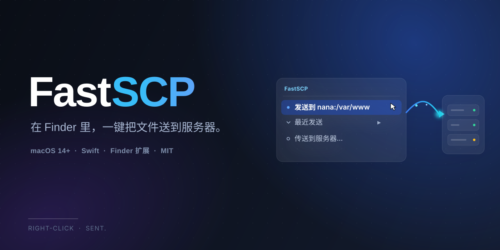

<p align="center">
  <picture>
    <source media="(prefers-color-scheme: dark)" srcset="docs/banner.svg">
    
  </picture>
</p>

<p align="center">
  <b>在 Finder 里，一键把文件送到服务器。</b><br>
  右键 → 传送 → 完成。
</p>

<p align="center">
  <a href="#install"></a>
  <a href="https://github.com/thy950523/mac-fast-scp/blob/main/LICENSE"></a>
  <a href="https://github.com/thy950523/mac-fast-scp/issues"></a>
  <a href="https://github.com/thy950523/mac-fast-scp/pulls"></a>
  
</p>

---

FastSCP 是一个 macOS **Finder 右键菜单扩展**：在任意文件或文件夹上右键，即可通过 SCP 一键传送到你已经配置好的 SSH 服务器。

它直接读取你已有的 `~/.ssh/config`，不维护第二份服务器列表；沿用系统原生的 `ssh` / `scp`，完整继承密钥认证、`ssh-agent`、`ProxyJump` 等全部能力。**没有 Dashboard、没有账户系统、没有学习成本，装上就用。**

## 目录

- [✨ 功能特性](#-功能特性)
- [1. 项目介绍](#about)
- [2. 安装与使用](#install)
- [3. SSH 配置指南（小白向）](#ssh-guide)
- [4. 贡献与反馈](#contributing)
- [5. 支持与赞助](#support)
- [🧱 架构与二次开发](#-架构与二次开发)

## ✨ 功能特性

- 🖱 **Finder 原生右键菜单**：任意文件/文件夹右键 → `FastSCP ▸ ...`
- ⚡ **一键发送到上次目标**：记住你上次传到哪，下次右键点一下就发，全程零弹窗
- 📋 **最近发送记录**：自动保留最近 5 个目标，右键菜单直接列出
- 🎯 **轻量目标选择窗**：换地方时弹一个紧凑小窗——服务器下拉 + 路径浏览（双击进入 / 返回上层 / 直接键入路径）
- 🔐 **零配置服务器列表**：直接读取 `~/.ssh/config`，Host 别名就是服务器，用户、端口、密钥、跳板机全部交给系统 SSH 解析
- 📊 **实时传输进度**：解析 `scp` 进度，百分比实时可见
- 🔕 **完成通知**：通过 macOS 原生通知告知成功/失败
- 🔒 **本地优先**：所有传输都由你机器上的系统 `ssh` / `scp` 完成，不经任何第三方服务器

---

<a id="about"></a>
## 1. 项目介绍

### 这是什么

FastSCP 是一个用 Swift / SwiftUI / AppKit 开发的 **macOS Finder Sync 扩展**。它由两部分组成：一个挂在 Finder 右键菜单里的扩展（负责抓取你选中的文件），一个没有 Dock 图标的后台 agent app（负责弹出面板、调用 `scp` 传输、记录历史）。

### 解决什么问题

开发者和运维每天都要反复做一件事：**把本地的代码包、日志、截图、配置文件传到服务器**。

传统做法要么：

- 打开终端，手敲一长串 `scp ./file.zip user@host:/var/www/...`，每次都要重复输入路径；
- 要么打开 FileZilla、Transmit 这类独立 GUI 工具，拖来拖去，和 Finder 的工作流割裂。

FastSCP 把这件事压缩到 **Finder 里右键一两次点击**：

```
右键选中的文件
└── FastSCP ▸
    ├── 发送到 nana:/var/www        ← 一键项，零弹窗
    ├── 最近发送 ▸                  ← 最近 5 个目标
    │     ├── server2:/opt/app/logs
    │     └── nana:/tmp
    └── 传送到服务器…               ← 弹小窗选新目标
```

### 它不做什么

为了保持"装上就用"的克制感，FastSCP **有意不做**这些事：

- ❌ 不维护独立的服务器/密码管理器——请用 `~/.ssh/config` 和 `ssh-agent`
- ❌ 不内置账号、不经过任何中继服务器——传输就是你机器到你服务器的直连
- ❌ 不做一个"完整 FTP 客户端"——目标是 80% 高频场景下的极速操作，不是取代 Transmit

### 技术栈

| 项 | 内容 |
|---|---|
| 最低系统 | macOS 14.0（Sonoma） |
| 语言 / UI | Swift 6、SwiftUI、AppKit、Finder Sync |
| 传输 | 系统原生 `ssh` / `scp` |
| 工程生成 | [XcodeGen](https://github.com/yonaskolb/XcodeGen) |
| 开源协议 | MIT |

---

<a id="install"></a>
## 2. 安装与使用

### 方式一：从源码构建（当前推荐）

目前项目以源码形式分发，使用 [XcodeGen](https://github.com/yonaskolb/XcodeGen) 生成 Xcode 工程。

#### 前置条件

- macOS 14.0（Sonoma）或更高
- Xcode 16+ 和命令行工具：`xcode-select --install`
- [XcodeGen](https://github.com/yonaskolb/XcodeGen)：`brew install xcodegen`
- `~/.ssh/config` 中至少有一个可用的 `Host` 别名（还没有？见[第 3 节](#ssh-guide)）

#### 一键构建并安装

仓库自带脚本，会自动完成 Release 构建、自底向上重签名、清理重复的扩展注册，并安装到 `/Applications`：

```bash
git clone https://github.com/thy950523/mac-fast-scp.git
cd mac-fast-scp

# 生成 Xcode 工程
xcodegen generate

# 构建 + 安装到 /Applications + 注册扩展
./scripts/install.sh
```

> 💡 日常开发的"生成工程 → 跑测试 → 构建 → 安装"一条龙，可以用 `./scripts/execute.sh`。

#### 手动分步构建（需要自定义时）

```bash
# 1. 生成 Xcode 工程
xcodegen generate

# 2. 编译
xcodebuild -project FastSCP.xcodeproj \
           -scheme FastSCP \
           -configuration Release \
           -destination 'platform=macOS' \
           build

# 3. 从 DerivedData 拷贝到 /Applications
#    （Finder Sync 扩展从 /Applications 加载最可靠）
```

### 启用 Finder 右键扩展

1. 打开 **系统设置 → 隐私与安全性 → 扩展 → Finder 扩展**（"System Settings → Privacy & Security → Extensions → Finder Extensions"）
2. 打开 **FastSCP Finder Extension** 的开关
3. 重启 Finder 让扩展生效：

   ```bash
   killall Finder
   ```

4. 验证扩展已加载（输出以 `+` 开头才算成功）：

   ```bash
   /usr/bin/pluginkit -m -v | grep "com.zhuzhong.FastSCP.FinderSync"
   # +    com.zhuzhong.FastSCP.FinderSync(1.0)
   ```

   > 如果开头是 `-` 或没有输出，再执行一次 `killall Finder`，或注销后重新登录。

### 开始使用

1. 在 Finder 里**右键任意文件或文件夹** → `FastSCP ▸ 传送到服务器…`
2. 服务器下拉选择你 `~/.ssh/config` 里的某个 `Host` 别名（例如 `nana`）
3. 路径框直接输入绝对路径（例如 `/var/www`）回车，或双击目录列表进入
4. 点击 **"发送 N 项 → nana:/var/www"**
5. 看到 macOS 通知提示成功。下次右键就会出现 **"发送到 nana:/var/www"** 一键项 🎉

### 常见问题

| 现象 | 原因 / 解法 |
|---|---|
| 系统设置里看不到扩展 | Ad-hoc 签名的扩展可能被 macOS 拒绝加载；在 Xcode 里选择你自己的开发者 Team 重新签名，或再执行一次 `killall Finder` |
| 右键菜单没有 FastSCP | 确认扩展开关已打开，并在"系统设置 → 通知"里允许 FastSCP 通知 |
| 服务器下拉是空的 | `~/.ssh/config` 里没有具体的 `Host` 块；`Host *` 通配项会被忽略 |
| 通知不弹 | 系统设置 → 通知 → FastSCP，允许通知 |
| 双击文件夹没反应 | 个别全局手势会拦截；用键盘 `Tab` 聚焦行后按回车也可进入 |
| 传输卡住 / 超时 | 先在终端确认 `ssh <别名>` 能正常登录；FastSCP 走的就是同一条系统 SSH |

---

<a id="ssh-guide"></a>
## 3. SSH 配置指南（小白向）

FastSCP 的服务器列表**完全来自你的 `~/.ssh/config`**。这一节手把手带你从零配好一个能被 FastSCP 识别的 SSH 别名。如果你已经能 `ssh 某个名字` 登录服务器，可以直接跳到[最后一步](#第四步让-fastscp-识别到)。

### 背景知识：SSH config 是什么

平时登录服务器你可能敲：

```bash
ssh root@192.168.1.100 -p 22 -i ~/.ssh/id_ed25519
```

`~/.ssh/config` 就是把这一长串参数起一个**短别名**。配好之后，上面那条命令等价于 `ssh myserver`。FastSCP 读取的就是这些短别名。

### 第一步：生成 SSH 密钥（如果还没有）

打开"终端"（Terminal.app），执行：

```bash
ls ~/.ssh/id_ed25519.pub 2>/dev/null && echo "已有密钥，跳过" || ssh-keygen -t ed25519 -C "你的邮箱@example.com"
```

- 一路回车即可（ passphrase 可留空，也可设置一个密码短语）
- 生成后会有两个文件：
  - `~/.ssh/id_ed25519` —— **私钥，绝不能发给任何人**
  - `~/.ssh/id_ed25519.pub` —— 公钥，要放到服务器上

### 第二步：把公钥放到服务器

用 `ssh-copy-id` 一行搞定（把 `root@你的服务器IP` 换成你真实的账号和地址）：

```bash
ssh-copy-id -i ~/.ssh/id_ed25519.pub root@你的服务器IP
```

它会提示你输入一次服务器密码。成功后，以后登录就不需要再输密码了。

> 没有 `ssh-copy-id`（极少见）也可以手动：
> ```bash
> cat ~/.ssh/id_ed25519.pub | ssh root@你的服务器IP "mkdir -p ~/.ssh && cat >> ~/.ssh/authorized_keys"
> ```

先验证免密登录成功：

```bash
ssh root@你的服务器IP      # 应该直接进去，不再要密码
exit
```

### 第三步：写一个 SSH 别名

编辑（没有就新建）`~/.ssh/config` 文件：

```bash
nano ~/.ssh/config
```

写入下面内容，按需修改：

```ssh-config
Host nana                         # ← 别名，随便起，FastSCP 里显示的就是它
    HostName 192.168.1.100        # ← 服务器 IP 或域名
    User root                     # ← 登录用户名
    Port 22                       # ← SSH 端口（默认 22，可改）
    IdentityFile ~/.ssh/id_ed25519   # ← 刚才生成的私钥
    ServerAliveInterval 60        # 可选：保持连接
```

保存（nano 里是 `Ctrl+O` 回车、`Ctrl+X` 退出）。

> **进阶：通过跳板机登录内网服务器** —— 加一行 `ProxyJump 跳板机别名` 即可，FastSCP 会自动沿用：
> ```ssh-config
> Host internal-db
>     HostName 10.0.0.5
>     User deploy
>     ProxyJump nana
> ```

设置文件权限（权限太开放 SSH 会拒绝读取）：

```bash
chmod 600 ~/.ssh/config
```

### 第四步：让 FastSCP 识别到

验证别名可用：

```bash
ssh nana        # 应该免密直接登录到你的服务器
```

然后**完全退出并重新打开 FastSCP**（或重新登录一次 Mac），右键 → `FastSCP ▸ 传送到服务器…`，服务器下拉里就能看到 `nana` 了。🎉

> ⚠️ `Host *` 这样的通配块是默认配置，FastSCP 会忽略它——只有写了具体名字的 `Host xxx` 才会出现在列表里。

---

<a id="contributing"></a>
## 4. 贡献与反馈

欢迎所有人参与这个小工具的迭代！它就是一个想让"传文件到服务器"变爽的个人项目，Issue、PR、建议都非常欢迎。

### 反馈问题 / 提需求

请到 GitHub Issues：

- 🐛 报告 Bug：<https://github.com/thy950523/mac-fast-scp/issues>
- 💡 提出想法：<https://github.com/thy950523/mac-fast-scp/discussions>（如未开启，直接开 Issue 即可）

提 Bug 时请尽量附上：

1. macOS 版本（`sw_vers`）
2. 复现步骤
3. 终端里 `ssh <你的别名>` 是否正常
4. 相关的错误通知 / 日志截图

### 提交 PR

1. Fork 本仓库并 clone 到本地
2. 运行 `xcodegen generate` 生成工程
3. 在 Xcode 中打开 `FastSCP.xcodeproj`，或用 `./scripts/execute.sh` 跑测试与构建
4. 修改代码并确保 `FastSCPCoreTests` 单元测试通过：

   ```bash
   xcodebuild -project FastSCP.xcodeproj -scheme FastSCPCore \
              -configuration Debug test \
              CODE_SIGN_IDENTITY=- CODE_SIGN_STYLE=Manual
   ```

5. 提交 PR，描述清楚动机和改动点。核心逻辑（SSH config 解析、路径解析、进度解析等）都在 `FastSCPCore` framework 里并配有单元测试，欢迎先加测试再改逻辑。

项目结构和架构说明见下方[🧱 架构与二次开发](#-架构与二次开发)。

### 联系方式

- **GitHub**：[@thy950523](https://github.com/thy950523)
- **邮箱**：mike950523@icloud.com
- 项目 Issue 是最可靠的联系方式（也方便其他人看到同样的问题）

### Roadmap

后续会持续迭代，已规划的方向记录在 [`docs/ROADMAP.md`](docs/ROADMAP.md)，包括：传输列表逐项进度、重复文件确认流程优化、面板 UI 改进等。非常欢迎在 Issue 里讨论优先级，或直接认领其中一项。

---

<a id="support"></a>
## 5. 支持与赞助

如果你觉得 FastSCP 让你的日常工作省了一点时间，愿意支持它继续打磨，可以用下面的方式请我喝杯咖啡 ☕。这完全是自愿的，不影响任何功能使用。

<p align="center">
  <br>
  <sub>微信扫码赞赏</sub>
</p>

无论以什么方式支持，都非常感谢你。🙏

<!--
后续如果要加支付宝 / Buy me a Coffee，把二维码图片放到 docs/ 后，
在上面的 <p align="center"> 里并排加入即可，例如：
  
-->

---

## 🧱 架构与二次开发

两个进程，职责分明：

```
┌────────────────────────────┐         ┌──────────────────────────────┐
│ FastSCPFinderSync           │ 写文件  │ FastSCP (agent app,无 Dock 图标) │
│ (沙盒,Finder Sync extension)│────────▶│ 读文件 + 解析 fastscp:// URL  │
│ • 在 Finder 右键加菜单      │ fastscp://│ • 弹一个小面板             │
│ • 抓选中路径                │   URL  │ • 用 ssh / scp 传输          │
│ • 写批文件 + 唤起主 app     │◀────────│ • 记忆最近目标              │
└────────────────────────────┘   通知   └──────────────────────────────┘
```

共享代码（`~/.ssh/config` 解析、`ls -ap` 解析、`scp` 进度解析、最近目标逻辑）放在 `FastSCPCore` framework 中，两个进程都链接，核心逻辑有单元测试覆盖。

### 项目结构

```
project.yml                       # xcodegen 真源（改完跑 xcodegen generate）
scripts/
  install.sh                      # Release 构建 + 重签名 + 安装到 /Applications
  execute.sh                      # 生成工程 → 测试 → 构建 → 安装
Sources/
  FastSCPCore/                    # 共享 framework（可单测）
    Constants.swift               #   bundle id / url scheme / app group
    Models.swift                  #   SSHHost, RemoteEntry, RecentDestination
    SSHConfigParser.swift         #   解析 ~/.ssh/config
    LsParser.swift                #   解析 `ls -ap` 输出
    SCPProgressParser.swift       #   解析 scp 进度
    RecentDestinations.swift      #   去重 + 排序 + 上限的纯逻辑
    RecentStore.swift             #   读写磁盘
    SharedPaths.swift             #   容器路径解析（app / extension 共用）
  FastSCP/                        # 主 app（无沙盒，因为要起 ssh/scp 子进程）
    Main.swift / AppDelegate.swift
    URLCoordinator.swift          #   fastscp:// 解析
    SelectionStore.swift          #   读 extension 写的批文件
    SSHExecutor.swift             #   ssh / scp 的 Process 封装
    DestinationPanel.swift        #   小弹窗
    Notifier.swift                #   UNUserNotificationCenter 包装
  FastSCPFinderSync/              # Finder 扩展（沙盒）
    FinderSync.swift              #   右键菜单 + 抓路径 + 唤起 app
Tests/
  FastSCPCoreTests/               # 核心逻辑单元测试
docs/
  ROADMAP.md                      # 后续迭代计划
  banner.svg / banner.png         # 开源宣传顶图
```

### 几个关键设计决定

1. **主 app 无沙盒，extension 有沙盒。** App Sandbox 不允许 app 起任意子进程，而 `ssh` / `scp` 必须由我们启动，所以主 app 关闭了沙盒；Finder Sync 扩展的沙盒是 Apple 强制的。
2. **默认 Ad-hoc 签名。** 命令行构建用 `CODE_SIGN_IDENTITY=-`。本地能跑，但 Finder 扩展的加载在部分 macOS 版本上可能因此被拒；在 Xcode 里选你自己的开发者 Team 即可正常签名。
3. **scp，不是 rsync。** v1 用 `scp`（任何 SSH 服务器都有）。`rsync --info=progress2` 进度更准但要求服务器端装了 `rsync`，留给后续版本。

更多细节见[原开发说明](docs/) 和代码注释。

---

<div align="center">

**FastSCP** · Right-click, sent.

MIT License © 2026 [zhuzhong](https://github.com/thy950523)

</div>
